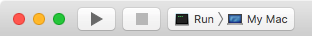
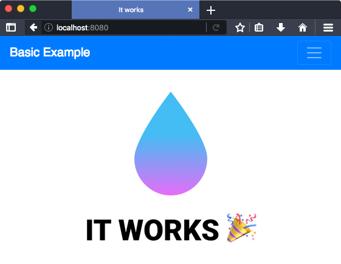

# [quickstart-bootstrap-basic][t]
[t]:https://github.com/VaporExamplesLab/quickstart-bootstrap-basic

<p align="center">
    <a href="http://docs.vapor.codes/3.0/">
        
    </a>
    <a href="LICENSE">
        
    </a>
    <a href="https://swift.org">
        
    </a>
</p>

<a id="toc"></a>
[Getting Started](#GettingStarted) •
[Original Setup](#OriginalSetup) •
[Resources](#Resources) 

## Getting Started <a id="GettingStarted">[▴](#toc)</a>

**Prerequisites**

* [Install Xcode 10 ⇗](https://itunes.apple.com/us/app/xcode/id497799835?mt=12)
* [Install homebrew ⇗](https://brew.sh/)
* [Install vapor toolbox ⇗](https://docs.vapor.codes/3.0/install/macos/)

**Clone, Build & Run**

``` bash
## go to your working directory
cd <your-choosen-directory-path>
git clone git@github.com:VaporExamplesLab/quickstart-bootstrap-basic.git 

cd quickstart-bootstrap-basic

# update dependencies 
# with `-y` yes to generate and open Xcode project
vapor update -y
```

Set Xcode scheme to "Run > My Mac".



Click the run button and check the results in a browser at `http://localhost:8080`.



## Original Setup <a id="OriginalSetup">[▴](#toc)</a>

The following steps were completed to create the `quickstart-basic` example. 


**Create Vapor Website Project**

Create a `quickstart-basic` project from the command line terminal:

``` bash
vapor new quickstart-basic --web
cd quickstart-basic
# add directory for README.md assets
mkdir README_files 
touch README_files/.git_keep # create file so folder is not empty for `git`  

# update dependencies 
# with `-y` yes to generate and open Xcode project
vapor update -y
```

**Add Bootstrap**

Use the Bootstrap starter template. On [getbootstrap.com](getbootstrap.com) click the _`Get started`_ button and scroll down to _`Starter template`_ section. The `<meta>`, `<link>` and `<script>` are added to Resources/View/base.leaf in the Vapor project. The `#get(body)` is placed inside a Bootstrap container `<div>`

_base.leaf_

``` html
<!doctype html>
<html lang="en">
<head>
    <!-- Bootstrap required meta tags -->
    <meta charset="utf-8">
    <meta name="viewport" content="width=device-width, initial-scale=1, shrink-to-fit=no">

    <!-- Bootstrap CSS -->
    <link rel="stylesheet" href="https://stackpath.bootstrapcdn.com/bootstrap/4.3.1/css/bootstrap.min.css" integrity="sha384-ggOyR0iXCbMQv3Xipma34MD+dH/1fQ784/j6cY/iJTQUOhcWr7x9JvoRxT2MZw1T" crossorigin="anonymous">

    <!-- Application overriding CSS -->
	<link rel="stylesheet" href="/styles/app.css">

    <title>#get(title)</title>
</head>
<body>
    <!-- navigation to go here. -->
    
    <!-- mt-3: margin top `1rem` -->
    <div class="container mt-3">
    #get(body)
    </div>
    
    <!-- JavaScript to support various Bootstrap features -->
    <!-- jQuery first, then Popper.js, then Bootstrap JS -->
    <script src="https://code.jquery.com/jquery-3.3.1.slim.min.js" integrity="sha384-q8i/X+965DzO0rT7abK41JStQIAqVgRVzpbzo5smXKp4YfRvH+8abtTE1Pi6jizo" crossorigin="anonymous"></script>
    <script src="https://cdnjs.cloudflare.com/ajax/libs/popper.js/1.14.7/umd/popper.min.js" integrity="sha384-UO2eT0CpHqdSJQ6hJty5KVphtPhzWj9WO1clHTMGa3JDZwrnQq4sF86dIHNDz0W1" crossorigin="anonymous"></script>
    <script src="https://stackpath.bootstrapcdn.com/bootstrap/4.3.1/js/bootstrap.min.js" integrity="sha384-JjSmVgyd0p3pXB1rRibZUAYoIIy6OrQ6VrjIEaFf/nJGzIxFDsf4x0xIM+B07jRM" crossorigin="anonymous"></script>

</body>
</html>
```

Add navigation to _base.leaf_ above the `<div>` body container.

``` html
<!-- navbar{-dark|-light|-primary} -->
<!-- bg{-dark|-light|-primary} | style="background-color: #e3f2fd;" -->
<nav class="navbar navbar-expand-md navbar-dark bg-primary">
  <a class="navbar-brand" href="/">Basic Example</a>
  <!-- Button toggles navigation bar for small screen sizes.
       Shows and hides the `navbarSupportedContent` section. -->
  <button class="navbar-toggler" type="button"
   data-toggle="collapse" data-target="#navbarSupportedContent"
   aria-controls="navbarSupportedContent" aria-expanded="false"
   aria-label="Toggle navigation">
    <span class="navbar-toggler-icon"></span>
  </button>
  <!-- Collapsable section for small screen. -->
  <div class="collapse navbar-collapse"
   id="navbarSupportedContent">
    <!-- Define a list of navigation `nav-item` links. -->
    <ul class="navbar-nav mr-auto">
      <li class="nav-item #if(title == "Hello, great to see you!"){active}">
        <a href="/hello/great to see you/" class="nav-link">One</a>
      </li>
      <li class="nav-item #if(title == "Hello, again!"){active}">
        <a href="/hello/again/" class="nav-link">Two</a>
      </li>
    </ul>
  </div>
</nav>

```

## Resources <a id="Resources">[▴](#toc)</a>

* [Bootstrap ⇗](https://getbootstrap.com)
* [Wenderlich: Beautifying Templated Websites with Leaf and Bootstrap ⇗](https://www.raywenderlich.com/1004734-beautifying-templated-websites-with-leaf-and-bootstrap)
